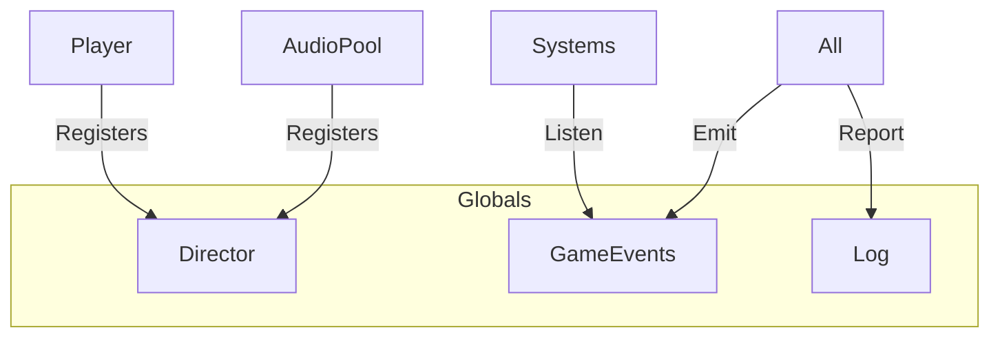
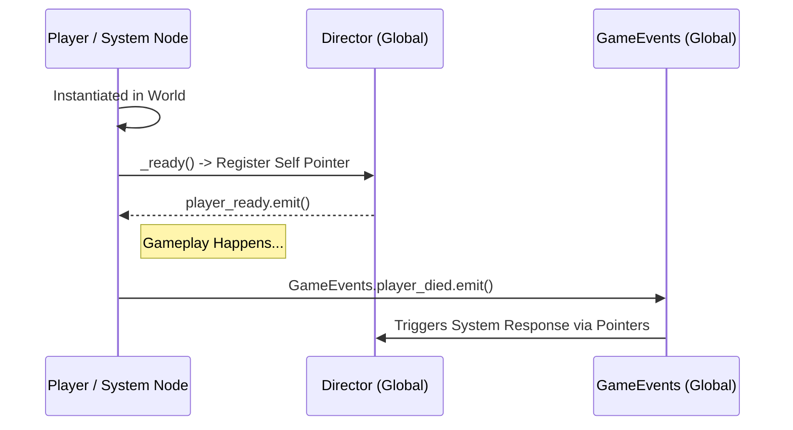
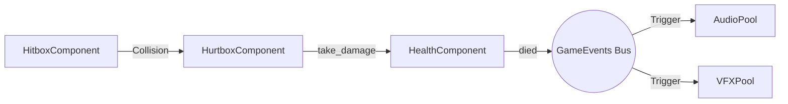
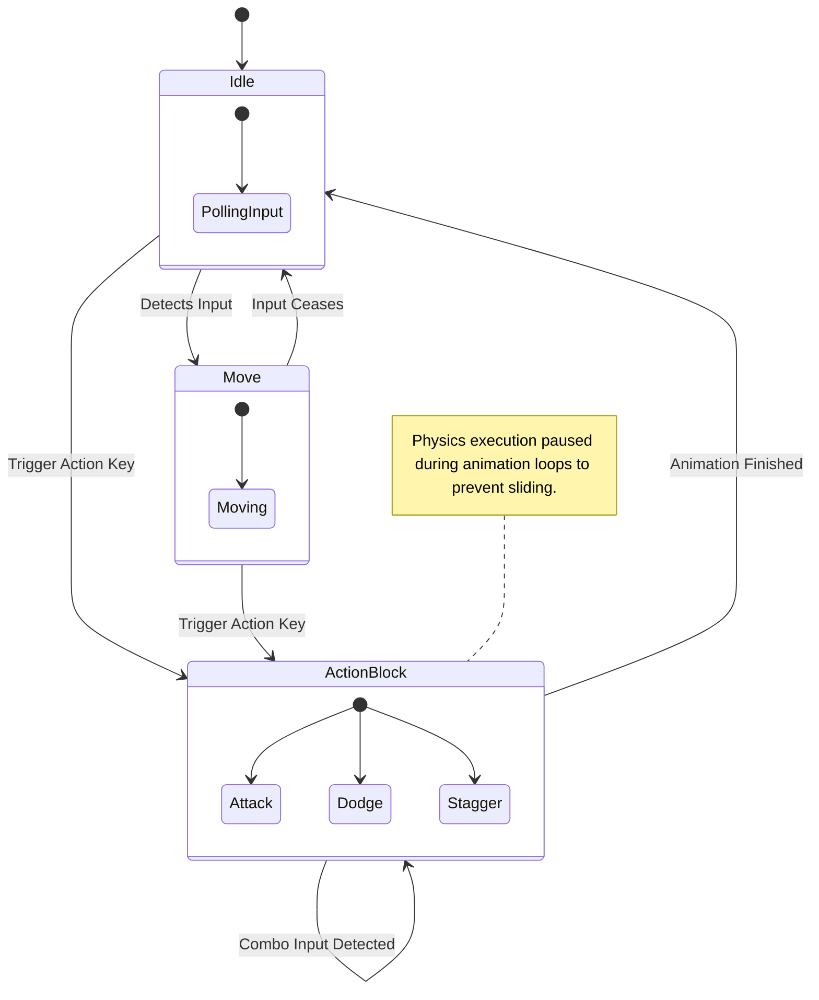

# Ashen Oath: The North Star Architecture Blueprint

---

## 1. The Sovereign Wrapper (Globals)

The project utilizes Autoload singletons to manage persistent state and cross-domain communication without circular coupling. This utilizes a "Sovereign Wrapper" architecture to eliminate raw circular dependencies and global spaghetti code.

### Core Singletons / Nodes

- **`Director.gd`**: Central reference gateway. The brain of the project. It explicitly _does not_ instantiate logic; instead, it holds persistent pointers to vital active nodes (like `player_health_component`, `quest_system`, `vfx_pool`). Use this to avoid `get_node` lookups.
- **`GameEvents.gd`**: The **Sovereign Signal Bus**. A detached Signal Bus used exclusively for multi-domain state changes (e.g., `player_died`, `item_collected`) where binding direct instances violates isolated component composition.
- **`Log.gd`**: Unified output stream for multi-severity diagnostics. Formats and unifies `stdout` emissions based on severity types `info`, `warn`, `error`, and `wow` (cinematic logging).

### Dependency Graph (Globals)



### Registration Flow



### Anti-Patterns Avoided

- Never query `get_tree().get_root().find_child("Player", ...)`. Always query `Director.player`.
- The `Director` must NEVER allocate heavy arrays or logic pools directly. It is purely a gateway for references obeying **SKILL-002 Zero Allocation**.

---

## 2. Entity-Component System (ECS)

Ashen Oath uses a composition-based approach for combat and character logic, heavily relying on modular Components to build entities iteratively rather than through rigid inheritance trees (e.g., deeply nesting `BigEnemy extends Enemy extends BaseActor`).

### Core Modularity Rules

- **No Hierarchical Knowledge:** A `HealthComponent` does NOT care if it is attached to a Player, Boss, or Wooden Crate. It strictly accepts `.receive_damage()` and emits `health_depleted`.
- **Stat Separation:** `StatsComponent` simply holds attributes and triggers level-up arithmetic. The `HealthComponent` reads maximum calculations on initialization or when forced.
- **Physical Isolation:** Interactions exist on explicit 3D Physics Layers (Project Layers 4 and 5).
  - Layer 4: `Player_Hitbox`
  - Layer 5: `Enemy_Hitbox`

### Primary Components

- **`AttributeComponent`**: Manages base stats (Strength, Vitality).
- **`HealthComponent`**: Handles damage, healing, and death signals. Implements **SKILL-001 (Backing Fields)**.
- **`HurtboxComponent`**: The receiver for collision damage. Links to `HealthComponent`.
- **`HitboxComponent`**: The emitter for collision damage. Implements **SKILL-009 (One-Shot Hitbox)**.

### Component Topology Map

```mermaid
graph LR
 %% Data Models
 subgraph Data Layers
  Stats[StatsComponent<br>Vitality, ATK, Level]
  Attrib[AttributeComponent<br>Base Multipliers]
 end

 %% State Logic
 subgraph Vitality Loop
  Health[HealthComponent<br>Signal: health_changed]
  Poise[PoiseComponent<br>Signal: posture_broken]
  Stamina[StaminaComponent<br>Signal: stamina_depleted]
 end

 %% Physics Boundary
 subgraph Physics Boundary
  Hitbox(HitboxComponent Area3D)
  Hurtbox(HurtboxComponent Area3D)
 end

 %% Connections
 Hitbox -- Passes Target AttackData --> Hurtbox
 Hurtbox -- Validates Hit & I-Frames --> Health
 Hurtbox -- Validates Poise Shock --> Poise
 Data Layers -. Feeds Max Caps .-> Vitality Loop
```

### Combat Loop Visualization



---

## 3. Hierarchical State Machines (HSM)

Player and Enemy logic is encapsulated in discrete State nodes. All complex CharacterBody3D actors utilize a localized, strictly segregated Hierarchical State Machine logic format rather than placing all execution paths in massive `_physics_process()` statements.

### The Rule of purity

According to the Ashen Oath implementation guides (**SKILL-008: The Phoenix-Pure State Machine**):

- Nodes inside the StateMachine operate independently.
- A State never changes itself directly via `get_parent().change_state()`. It emits a `Transitioned(self, "NewStateName")` signal. This ensures that the root `StateMachine.gd` dictates flow control.

### Player States

- **`PlayerIdleState`**: Default state, monitors movement input.
- **`PlayerMoveState`**: Handles locomotion and rotation. Implements **SKILL-011 (Action-Matrix)**.
- **`PlayerAttackState`**: Handles combat animations and hitbox activation. Implements **SKILL-008 (Phoenix-Pure)**.

### State Machine Graph



### Input Buffering (Ghost-Proof Logic)

To ensure reliable Action/RPG inputs (**SKILL-010**), inputs acquired during `ActionBlock` states (e.g. dodging while already attacking) are pushed into a micro-buffer matrix so the subsequent Action state triggers seamlessly upon the precise animation-finish frame.

---

## 4. Systems & Optimization

- **`VFXPool`**: Zero-allocation pool for visual effects (**SKILL-002**).
- **`AudioPool`**: High-frequency SFX management with randomized pitch scaling.

---
**Status**: PRS-001 Conceptual Engineering Phase COMPLETE.
**Governed By**: [AGENTS.md](../AGENTS.md) | [SKILL_LIBRARY.md](../tools/registry/SKILL_LIBRARY.md)
