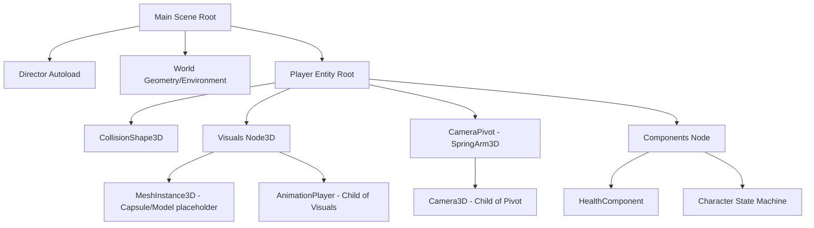

# The Sovereign Hierarchy & Connection Manual (v1.0)

This manual provides the definitive architectural blueprint for the **Ashen Oath** engine. Use this to ensure your nodes are correctly nested and your scripts are perfectly synchronized.

## 🛡️ 1. The Global Hierarchy Tree

Every scene must follow a "Director-Factory" topology. This is why each layer is necessary.



### 🛡️ Why each node is necessary

- **SpringArm3D (Pivot)**: Prevents the camera from clipping into walls. It acts as a physical distance meter.
- **Visuals (Node3D)**: This is a "Folder" for all visual assets. We separate it from the `Player` root so we can rotate the mesh without rotating the physics body.
- **Director (Autoload)**: Handles cross-scene communication (e.g., Respawning).

---

## 🛡️ 2. Connecting Nodes to Scripts

In Godot, scripts talk to nodes in three primary ways.

### A. The `@export` Method (Recommended)

This Is the most flexible. You define a variable in the script and click/drag the node in the **Inspector**.

```gdscript
# [COMM.Avatar.Player.gd](file:///c:/Users/Chris/Ashen%20Oath-3rd%20Person%20RPG/scripts/entities/player/COMM.Avatar.Player.gd)
@export var camera_pivot: SpringArm3D
@export var health_node: HealthComponent
```

**Why use it?** If you rename a node in the tree, the script won't break because the Inspector reference remains.

### B. The `$` (NodePath) Method

Used for internal, permanent children.

```gdscript
func _ready():
    # If the path changes in the editor, this BREAKS your script
    var anim := $Visuals/AnimationPlayer
```

### C. The `unique_name_in_owner` (%) Method

Right-click a node and select **"Access as Unique Name"**.

```gdscript
func _hurt():
    # Finds the node anywhere in the Player scene
    %HealthComponent.damage(10)
```

---

## 🛡️ 3. Fixing the "Swinging Camera" & "Black Strings"

### THE CAMERA FIX

If your camera swings wildly, it’s usually because the **Player** is rotating and the **Camera** is inheriting that rotation (Double Rotation).

1. Set the Camera node to `Top Level = true` in the Inspector.
2. Use the following logic in [COMM.Avatar.PlayerCamera.gd](file:///c:/Users/Chris/Ashen%20Oath-3rd%20Person%20RPG/scripts/entities/player/COMM.Avatar.PlayerCamera.gd) (already attempting this in v16.0):

```gdscript
func _physics_process(delta):
    # Match the player's position but IGNORE their rotation
    global_position = get_parent().global_position + Vector3(0, 1.5, 0)
```

### THE MESH FIX ("Black Strings")

If you see black geometric strings, your model's **Scaling** or **Bone Data** is zeroed or corrupted.

1. Select your **MeshInstance3D**.
2. Go to the **Inspector -> Transform**.
3. Ensure Scale is `(1, 1, 1)`, NEVER `(0, 0, 0)`.
4. Current problem in [Player.tscn](file:///c:/Users/Chris/Ashen%20Oath-3rd%20Person%20RPG/scenes/entities/Player.tscn): You are using a **Boss** AnimationPlayer on the player. This often causes "bone mismatch" which looks like black strings.

---

## 🛡️ Step-By-Step: Creating a New Entity

1. **Create Root**: New `CharacterBody3D`. Attach script.
2. **Add Visuals**: Add a `Node3D`, name it "Visuals". Add a `MeshInstance3D` child.
3. **Define Scripts**: In the root script, use `@export var visuals: Node3D`.
4. **Assign**: Select the root node, and in the Inspector, drag the "Visuals" node into the "visuals" property slot.
5. **Verify**: Run the scene. If the script can't find the node, Godot will throw an "Invalid Access" error in the debugger.
