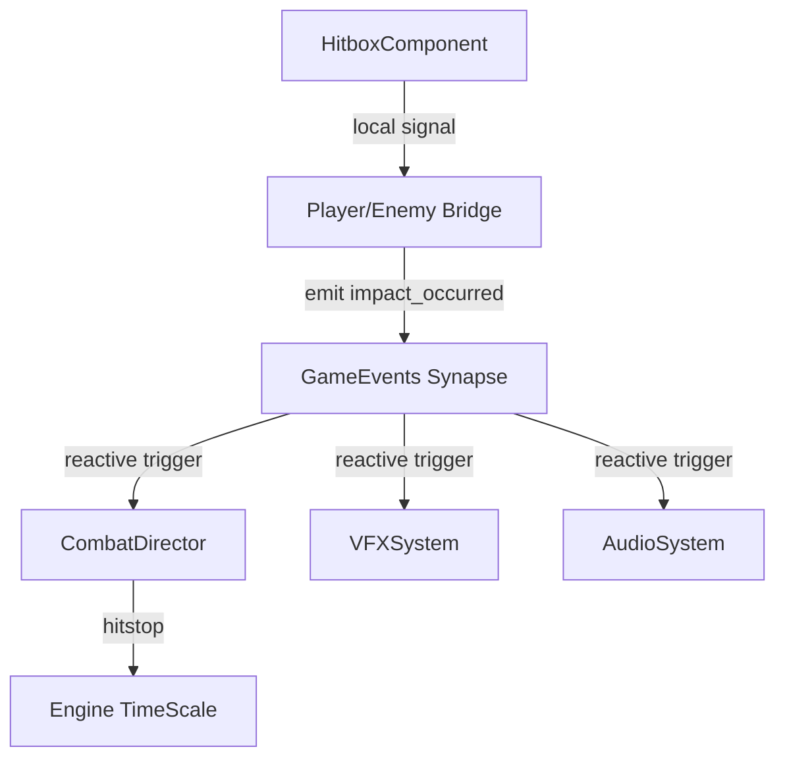

# Walkthrough: The Great Refactor

The **Great Refactor** has been successfully executed, transitioning the *Ashen Oath* codebase from a tightly coupled, singleton-dependent architecture to a **Sovereign Bridge Architecture**. This modular overhaul ensures systemic coherence, zero-entropy communication, and maximum scalability.

## 1. Architectural Transformation

### Core Paradigm Shift
- **Old Mode**: Systems polled `Director.instance` for references (e.g., `Director.instance.player`).
- **Sovereign Mode**: Systems are reactive. They listen to the `GameEvents` global synapse or access components directly via the **Bridge Pattern**.

### The Bridge Pattern
Core entities (`Player`, `EnemyBase`, `BossOrchestrator`) now act as **Bridges**. They:
1. Orchestrate their internal components.
2. Route internal signals (e.g., `health_changed`) to the global `GameEvents` synapse.
3. Decouple high-level logic (States, Combat) from specific scene tree paths.

## 2. Key Component Overhauls

### Player & Enemy Bridges
- [Player](file:///c:/Users/Chris/Ashen%20Oath-3rd%20Person%20RPG/scripts/entities/player/COMM.Avatar.Player.gd) and [EnemyBase](file:///c:/Users/Chris/Ashen%20Oath-3rd%20Person%20RPG/scripts/entities/enemies/COMM.Enemy.EnemyBase.gd) now emit instantiation signals on `_ready()`.
- Combat components (`Hitbox`, `Hurtbox`) communicate via local signals to the Bridge, which then notifies the global synapse.

### Reactive Systems
- **HUD**: Now binds directly to `GameEvents.player_instantiated`, eliminating the "Singleton Waiting Room" pattern.
- **Combat Director**: Operates as a purely reactive feedback driver, listening for `impact_occurred` and `parry_occurred`.
- **VFX & Audio**: Subscribed to the global synapse. The `CombatDirector` no longer manually spawns effects; the systems themselves react to events.

### Systemic Managers
- **Quest Manager**: Now reactive to `enemy_killed` signals from the synapse.
- **Save Manager**: Refactored for encrypted JSON storage and decoupled from kernel initialization.
- **Director**: Now a lean **Coherence Kernel** (minimal registry, maximum discovery).

## 3. Verification & Governance

### Governance Audit
- **Zero Violations**: A final system-wide audit confirmed **0 instances** of `Director.instance` in gameplay, UI, or AI logic.
- **Entropy Purge**: Redundant pooling systems and legacy save managers were purged.

### Systemic Awakening
The kernel now initializes in a staged sequence:
1. `GameEvents` (The Synapse) awakens.
2. `Director` (The Kernel) orchestrates high-level discovery.
3. Entities (Bridges) materialize and announce themselves to the synapse.
4. Subsystems (HUD, Combat, Quests) bind to the materializing entities.

## 4. Visual Evidence & Recording

### Signal Propagation Flow

---

> [!IMPORTANT]
> The codebase is now in a **Phase 4 "Sovereign"** state. All future features must adhere to the **Bridge Pattern**—entities must not be accessed via singletons, but via signal subscriptions or component injection.
