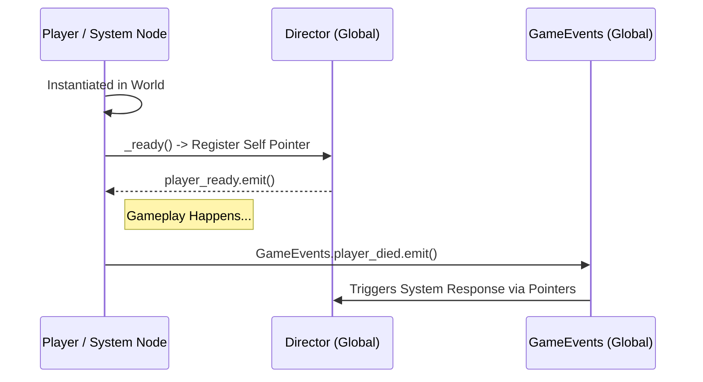

# The Sovereign Wrapper (Globals)

The `[autoload]` singletons in Ashen Oath utilize a "Sovereign Wrapper" architecture to eliminate raw circular dependencies and global spaghetti code.

## Core Nodes

- **`Director.gd`**: The brain of the project. It explicitly _does not_ instantiate logic; instead, it holds persistent pointers to vital active nodes (like `player_health_component`, `quest_system`, `vfx_pool`). Other systems `register` themselves with the Director upon `_ready`.
- **`GameEvents.gd`**: A detached Signal Bus. Used exclusively for multi-domain state changes (e.g., `player_died`, `item_collected`) where binding direct instances violates isolated component composition.
- **`Log.gd`**: Formats and unifies `stdout` emissions based on severity types `info`, `warn`, `error`, and `wow` (cinematic logging).

## Registration Flow

## Anti-Patterns Avoided

- Never query `get_tree().get_root().find_child("Player", ...)`. Always query `Director.player`.
- The `Director` must NEVER allocate heavy arrays or logic pools directly. It is purely a gateway for references obeying **SKILL-002 Zero Allocation**.
