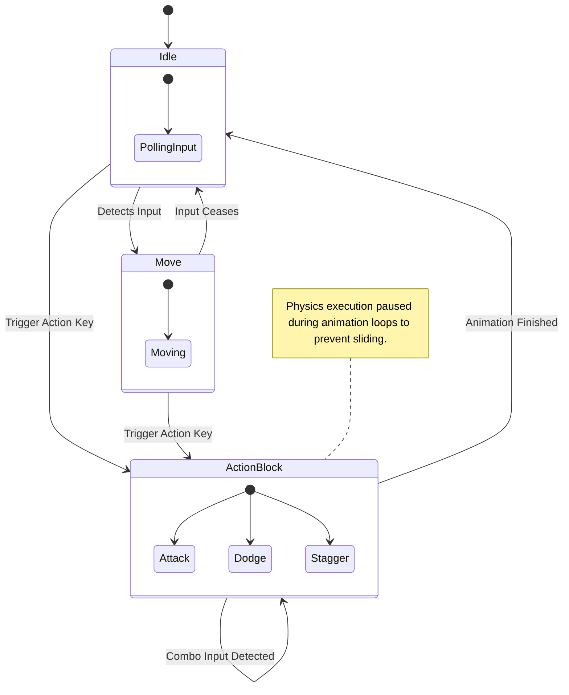

# "Phoenix-Pure" State Machines

All complex CharacterBody3D actors (Players and Enemies) utilize a localized, strictly segregated Hierarchical State Machine (HSM) logic format rather than placing all execution paths in massive `_physics_process()` statements.

## The Rule of purity

According to the Ashen Oath implementation guides (**SKILL-008: The Phoenix-Pure State Machine**):

- Nodes inside the StateMachine operate independently.
- A State never changes itself directly via `get_parent().change_state()`. It emits a `Transitioned(self, "NewStateName")` signal. This ensures that the root `StateMachine.gd` dictates flow control.

## State Machine Graph

## Input Buffering (Ghost-Proof Logic)

To ensure reliable Action/RPG inputs (**SKILL-010**), inputs acquired during `ActionBlock` states (e.g. dodging while already attacking) are pushed into a micro-buffer matrix so the subsequent Action state triggers seamlessly upon the precise animation-finish frame.
